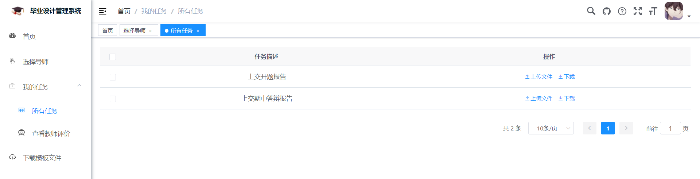

## 网址

部署地址：http://114.116.215.89/

## 测试账号

- 主任端：

  登录账号：20100000

  登录密码：123456

- 教师端

  登录账号1：20106666

  登录密码：123456

  登录账号2：20108888

  登录密码：123456

- 学生端：

  登录账号1：2018214288

  登录密码：123456

  登录账号2：2018000000

  登录密码：123456

  登录账号3：2018111111

  登录密码：123456

## 主要功能

### 主任端

#### 用户管理

可以在这里进行对教师和学生的增删改查	

下载模板后，通过Excel表导入教师和学生，并在导入时分组（输入部门编号）

暂时还没有做 组名=>组id 的映射，只能先从数据库里获取组id进行分组

**分组对照表**

103 导师组一
104 导师组二
105 导师组三

108 学生组一
109 学生组二
200 学生组三
201 学生组四
202 学生组五

自测时采用的数据表：

导入教师

| 用户序号 | 登录名称 | 用户名称 | 部门编号 | 手机号码    | 用户性别 | 职称 | 指导学生数 | 描述         |
| -------- | -------- | -------- | -------- | ----------- | -------- | ---- | ---------- | ------------ |
| 11       | 20106666 | BO       | 103      | 18888888888 | 0        | 讲师 | 2          | Java架构方向 |
| 12       | 20108888 | 王波     | 104      | 18888888888 | 0        | 讲师 | 1          | Web应用方向  |

导入学生

| 用户序号 | 登录名称   | 用户名称 | 部门编号 | 手机号码    | 用户性别 | 班级    |
| -------- | ---------- | -------- | -------- | ----------- | -------- | ------- |
| 21       | 2018214288 | xu       | 108      | 18888888888 | 0        | 软件1班 |
| 22       | 2018000000 | 周春续   | 109      | 18888888888 | 0        | 软件2班 |
| 23       | 2018111111 | 张三     | 109      | 18888888888 | 1        | 软件3班 |

#### 分组管理

对组进行新增和修改，还未做组名=>组id 的映射，新增之后暂时先从数据库获取对应组id

#### 发布任务

支持对上传文件名称规则的映射，暂时实现了@学生姓名,@学号,@毕设题目的映射

#### 选择导师任务

当前数据库里学生有3位，后端会统计出来数据给前端，前端计算一下当前已分配的指导学生数2+0 = 2, 然后3-2 = 1,得出`待分配学生数: 1`

**修改时不能超出最大学生数**

此时	

所以当前可输入学生最大数: 1，如果输入2，并确认修改，会弹出提示

#### 上传模板文件

### 教师端

#### 查看学生论文

可以下载并给出建议，这里只会列出选择过当前教师（并且已经传过文件）的学生的论文，不是他指导的学生不会显示。

其中的搜索是模糊搜索，文件名已经按照规范拼接好，可以只搜索学生姓名、学号、课题、报告类型。

#### 确定学生课题

对选择过他的学生进行课题修改

### 学生端

#### 选择导师

已选过只会显示退选按钮，未选过只会显示选择按钮

退选导师不匹配会提示

#### 所有任务

在这里上传文件或者下载已上传的文件

上传的时候会根据主任发布任务时填写的文件名称规则进行拼接（前端拼接）

例如学生xu上传了文件名为XXX的文件，主任端填写的文件名称规则是`@学生姓名,@学号,@毕设题目,开题报告`,上传到服务器后，文件名会变为`xu-2018214288-RPC远程框架-开题报告`

如果之前在某一任务未上传过文件，点击下载会弹出提示

有的话就直接下载了

#### 查看教师评价

在这里查看教师建议

如果教师还未给出建议，提示

#### 下载模板文件

在这里下载主任上传的模板文件

